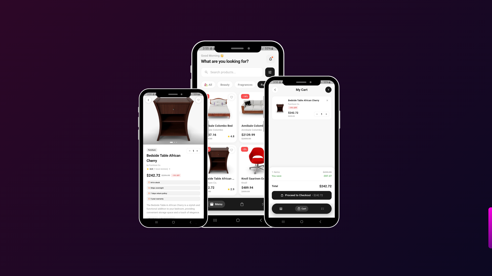

# 🛍️ Store App
<div align="center">



A modern, clean Flutter e-commerce app with a full shopping experience — from browsing products to checkout.

[📱 Download APK](#-download) • [🎥 Watch Demo](#-demo)

</div>

---

## 🎥 Demo

> 📹 **Video demo coming soon**
> 
> *(Add your video link here)*

---

## 📱 Download

> 📦 **APK download coming soon**
>
> *(Add your APK link here)*

---

## ✨ Features

| Feature | Tech Used |
|---|---|
| 🔐 Login & Authentication | REST API + Dio |
| 🛒 Products List & Details | REST API + BLoC |
| 🛍️ Add to Cart | SQLite (local) |
| 💳 Checkout & Payment | SQLite (local) |
| ✅ Todo Task Manager | SQLite (local) |
| 🌅 Splash Screen | flutter_native_splash |
| 🎨 Custom App Icon | flutter_launcher_icons |

> **Why SQLite for Cart & Checkout?**  
> The API doesn't support cart or payment features — so I built them locally using SQLite to give users the full shopping experience offline.

---

## 📸 Screenshots

<div align="center">

| Login | Home | Product Detail |
|---|---|---|
| *(add screenshot)* | *(add screenshot)* | *(add screenshot)* |

| Cart | Checkout | Todo |
|---|---|---|
| *(add screenshot)* | *(add screenshot)* | *(add screenshot)* |

</div>

---

## 🏗️ Architecture

```
lib/
├── core/
│   ├── di/                  # Dependency Injection (GetIt)
│   ├── networking/          # Dio + API client
│   ├── routing/             # App Router
│   ├── utils/               # Colors, constants
│   └── widgets/             # Shared widgets
│
└── features/
    ├── login/               # Login screen + BLoC + API
    ├── home/                # Products list + BLoC + API
    ├── cart/                # Cart (SQLite)
    ├── checkout/            # Checkout & payment (SQLite)
    └── todo/                # Todo tasks (SQLite)
```

---

## 🔧 Tech Stack

- **Flutter** — UI framework
- **BLoC / Cubit** — State management
- **Dio** — HTTP client
- **GetIt** — Dependency injection
- **SQLite (sqflite)** — Local database for cart, checkout & todo
- **flutter_screenutil** — Responsive UI
- **flutter_native_splash** — Native splash screen
- **flutter_launcher_icons** — Custom app icon
- **flutter_secure_storage** — Secure token storage

---

## 🔌 API

This app uses **[DummyJSON](https://dummyjson.com/)** as the backend API.

| Endpoint | Usage |
|---|---|
| `POST /auth/login` | User login |
| `GET /products` | Fetch all products |
| `GET /products/:id` | Fetch product details |

> **Demo Credentials**  
> Username: `emilys` / Password: `emilyspass`

---

## 🚀 Getting Started

### Prerequisites

- Flutter SDK `^3.11.0`
- Dart SDK `^3.11.0`

### Installation

```bash
# 1. Clone the repo
git clone https://github.com/taha2901/store-app.git
cd store_app

# 2. Install dependencies
flutter pub get

# 3. Run the app
flutter run
```

---

## 👨‍💻 Built By

> Made with Taha Hamada using Flutter

---

<div align="center">
  <sub>⭐ If you like this project, give it a star!</sub>
</div>


